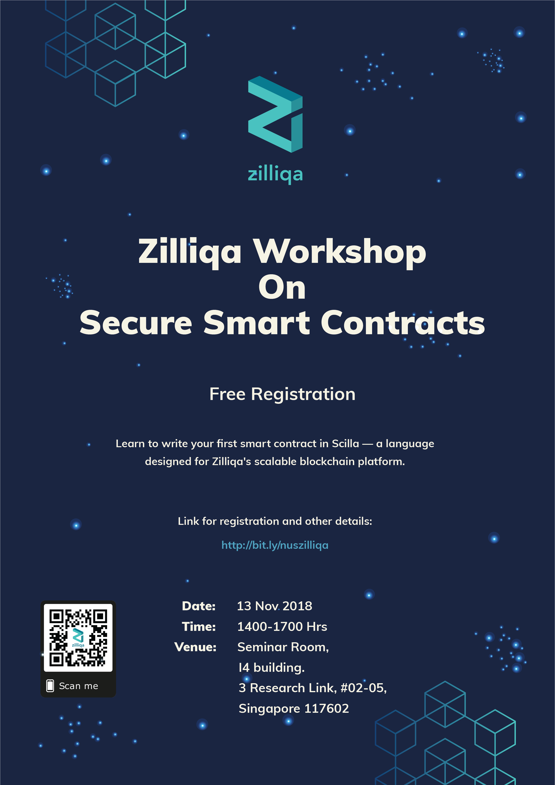

# Scilla_Workshop
Zilliqa Smart Contract Language Workshop
```
Date: 13 Nov 2018
Time: 14:00 - 17:00 Hrs
Venue: Seminar Room, I4 Building. 3 Research Link, #02-05, Singapore 117602
```

## Smart Contract Intermediate Level LAnguage (Scilla)
A safe-by-design language that is amenable to formal verification. Written by Zilliqa Team.
Visit https://scilla-lang.org/ for more information.
+ Head of Research : Amrit Kumar
+ Lead Language Designer: Ilya Segey
+ Compiler Developer: Jacob Johannsen
+ Compiler Developer: Vaivaswatha Nagaraj


